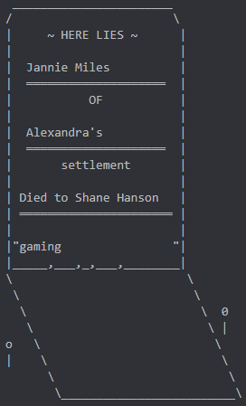

# Tombstones

We uploaded this as an example to show how Lua mods work within After the Collapse.

It contains the client-side source code to the mod, and it's heavily-commented.

Enjoy! ♥ Please let us know if you have any feedback about this mod or the system altogether.

## [Install from the Workshop](https://steamcommunity.com/sharedfiles/filedetails/?id=1541010614)

## Install manually

Download this repository as a .zip, and drag all of the files into a subdirectory of your mods/ directory.